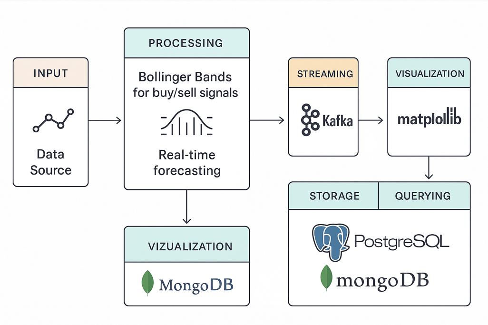

# Real-Time-Stock-MarketAnalysis
Stock Market Analysis with Real Time Streaming using Apache Kafka
# 📈 Real-Time Stock Market Analysis with Apache Kafka

This project implements a real-time stock market analysis pipeline using **Apache Kafka** for streaming data. It features **Bollinger Bands** for generating buy/sell signals and conducts **trend and seasonality analysis** on incoming stock price data.

## 🚀 Overview

The system is designed to ingest real-time stock data, process it through analytical modules, and visualize key financial indicators such as:
- 📉 Bollinger Bands (for identifying trading signals)
- 🔄 Seasonality and Trend patterns
- 📊 Real-time data visualization

The goal is to provide near real-time insights for stock traders or analysts by leveraging Kafka's event-streaming capabilities.

## 🛠️ Features

- Real-time data ingestion using **Apache Kafka**
- Technical analysis using Bollinger Bands
- Time series analysis for detecting trends and seasonality
- Live visualizations and signal updates
- Modular and extensible pipeline design

## 📂 Project Structure

| File | Description |
|------|-------------|
| `Producer.py` | Produces real-time stock data to a Kafka topic |
| `Consumer.py` | Consumes data from Kafka and processes it for analysis |
| `BollingerBands.py` | Computes Bollinger Bands and generates buy/sell signals |
| `TimeSeriesAnalysis.py` | Performs trend and seasonality analysis |
| `DataViz.py` | Generates real-time plots and visualizations |
| `Forecasted_Prices/` | *(Please confirm: is this a directory or script? What does it contain?)* |
| `PipelineSchema.png` | Visual overview of the data pipeline |
| `README.md` | Project documentation |

## 🖼️ Pipeline Overview



*Above: Visual representation of the pipeline architecture.*

## 📦 Tech Stack

- **Apache Kafka** - real-time data streaming
- **Python** - primary language
- **pandas**, **numpy** - data processing
- **matplotlib** - data visualization


## 🛠️ Installation

```bash
# Clone the repo
git clone https://github.com/yourusername/stock-market-streaming.git
cd stock-market-streaming

# Create virtual environment (optional but recommended)
python -m venv venv
source venv/bin/activate  # On Windows: venv\Scripts\activate

# Install dependencies
pip install -r requirements.txt
